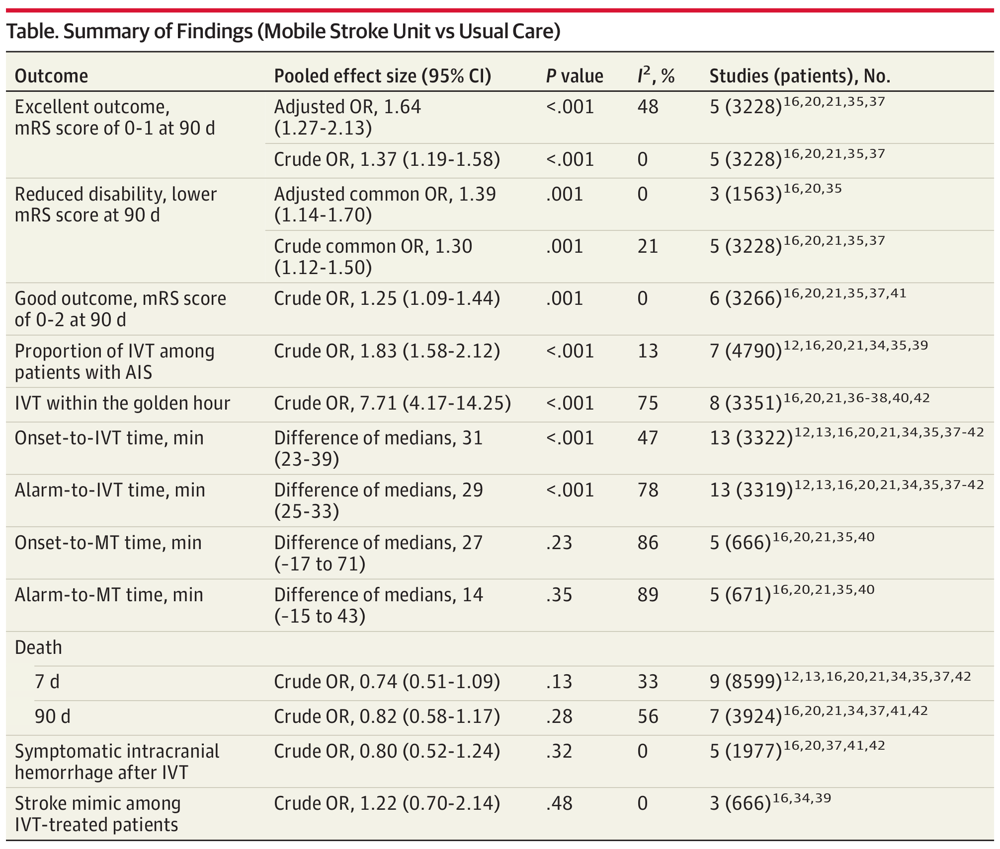
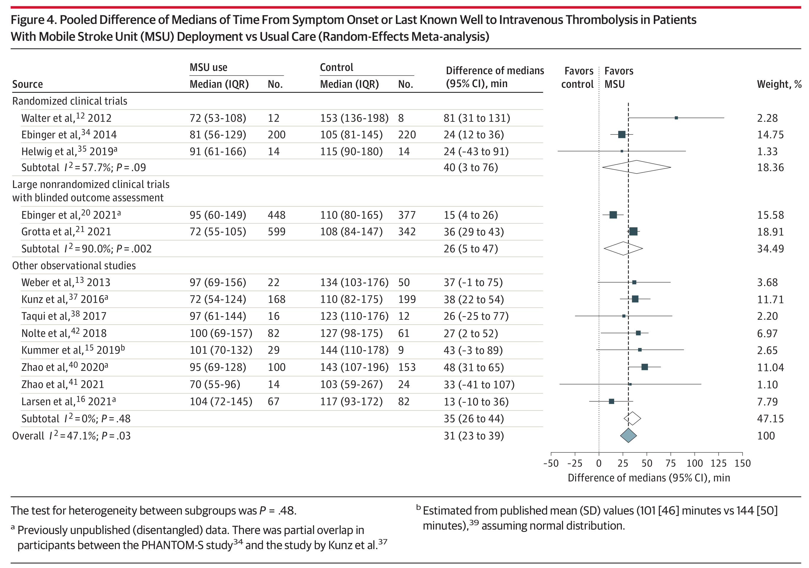

# Comparison of Mobile Stroke Unit With Usual Care for Acute Ischemic Stroke Management: A Systematic Review and Meta-analysis

Turc G, Hadziahmetovic M, Walter S, Churilov L, Larsen K, Grotta JC, Yamal J-M, Bowry R, Katsanos AH, Zhao H, et al. Comparison of Mobile Stroke Unit With Usual Care for Acute Ischemic Stroke Management: A Systematic Review and Meta-analysis. JAMA Neurology. 2022 ;Available from: https://doi.org/10.1001/jamaneurol.2021.5321

## What is a Mobile Stroke Unit (MSU)?

MSU (mobile stroke unit): a specialized ambulance equipped with computed tomography scanner, point-of-care laboratory, and neurological expertise).

## Key Points

*Question*: In patients with acute ischemic stroke, does mobile stroke unit (MSU) use lead to better functional outcomes than
usual care?

*Findings*: In this systematic review and meta-analysis including 14 articles, MSU use was significantly associated with an
approximately 65% increase in the odds of excellent outcome at 90 days after adjustment for potential confounders, a higher
proportion of intravenous thrombolysis, and a reduction of half an hour in onset-to-thrombolysis time, without safety concerns.

*Meanings*: These results provide evidence that MSU use improves functional outcome compared with usual care and may help guideline writing committees and decision makers to organize prehospital care.

## Methodology

Systematic review.

## Outcome measured

Primary:
* mRS 0-1 at 90 days.

Others: 
* mRS 0-2 at 90 days
* Reduced disability (improvement of at least 1 point in mRS)
* IVT use
* IVT started within 60 minutes of stroke onset
* Onset to IVT
* Onset to MT
* Ambulance dispatch to IVT (alarm to IVT)
* Ambulance dispatch to MT (alarm to MT)

Safety:
* All-cause mortality at 7 and 90 days
* Symptomatic intracranial hemorrhage (according to the definition of each study) among IVT-treated patients
* Proportion of IVT-treated patients ultimately diagnosed as stroke mimics.

## Key results

RESULTS Compared with usual care, MSU use was associated with excellent outcome (adjusted odds ratio [OR], 1.64; 95% CI, 1.27-2.13; P < .001; 5 studies; n = 3228), reduced disability over the full range of the mRS (adjusted common OR, 1.39; 95% CI, 1.14-1.70; P = .001; 3 studies; n = 1563), good outcome (mRS score of 0 to 2: crude OR, 1.25; 95% CI, 1.09-1.44; P = .001; 6 studies; n = 3266), shorter onset-to-intravenous thrombolysis (IVT) times (median reduction, 31 minutes [95% CI, 23-39]; P < .001; 13 studies; n = 3322), delivery of IVT (crude OR, 1.83; 95% CI, 1.58-2.12; P < .001; 7 studies; n = 4790), and IVT within 60 minutes of symptom onset (crude OR, 7.71; 95% CI, 4.17-14.25; P < .001; 8 studies; n = 3351). MSU use was not associated with an increased risk of all-cause mortality at 7 days or 90 days or with higher proportions of symptomatic intracranial hemorrhage after IVT.

Results on time to treatment:

